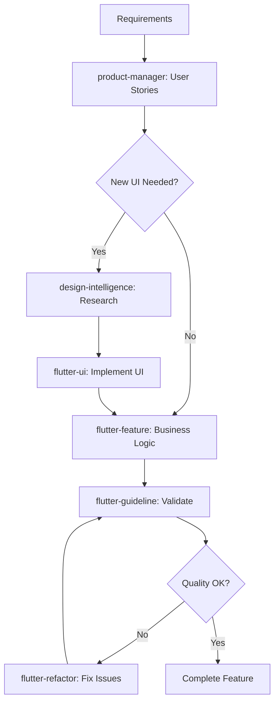

# 🧠 Project Architect (Strategic Planning)

Analyzes requirements and produces **detailed technical execution plans** with phased implementation and multi-skill coordination.

---

## 🎯 When to Use

Invoke when user requests:

- **"Build [app name]"**
- **"Start a new project for [domain]"**
- **"Plan [feature] implementation"**
- **"Create roadmap for [product]"**
- **"Design architecture for [system]"**

---

## 🔗 Skill Coordination Overview

This skill **orchestrates all other skills** to deliver complete solutions:

### Coordinated Skills

| Skill                   | Purpose                                                | When Used                              |
| ----------------------- | ------------------------------------------------------ | -------------------------------------- |
| **product-manager**     | Define requirements, user stories, acceptance criteria | Phase 1: Requirements                  |
| **design-intelligence** | Research UI/UX patterns, gather design inspiration     | Phase 2: Before UI implementation      |
| **flutter-feature**     | Generate Clean Architecture feature modules            | Phase 3: Business logic implementation |
| **flutter-ui**          | Build beautiful, accessible UI components              | Phase 3: UI implementation             |
| **flutter-guideline**   | Enforce code quality standards                         | All phases: Validation                 |
| **flutter-refactor**    | Improve existing code quality                          | When modernizing existing code         |

### Coordination Workflow



---

## 🔍 Phase 1: Requirements Analysis

### 1.1 Quick Context Gathering

Ask essential questions upfront:

```yaml
Business Domain:
  - What problem does this solve?
  - Who are the primary users?
  - What's the core value proposition?

Technical Context:
  - Platform? (Mobile/Web/Desktop)
  - Offline required?
  - API/Backend available or needed?
  - Team size and experience?

Constraints:
  - Timeline?
  - Budget/resource limits?
  - Must-have vs nice-to-have?
```

**Skill Coordination:**

```yaml
After gathering context:
  → Use product-manager to:
    - Create user stories
    - Define acceptance criteria
    - Prioritize features (RICE scoring)
    - Identify success metrics
```

**Example:**

```
User: "Build a wholesale shop app"

Architect: "Great! Let me understand the context:

1. **Users:** Who will use this? (Shop owner, staff, both?)
2. **Core workflows:** Main tasks? (Inventory, sales, credit tracking?)
3. **Platform:** Mobile only or web too?
4. **Offline:** Must work offline?
5. **Backend:** Have existing API or need to build?
6. **Timeline:** Target launch date?

Once I understand these, I'll coordinate with:
- product-manager: Define user stories and priorities
- design-intelligence: Research inventory app UI patterns
- flutter-feature: Plan Clean Architecture structure
"
```

---

### 1.2 Domain Modeling (with product-manager)

Identify core entities and relationships:

**Coordinated Approach:**

```yaml
Step 1: Architect identifies entities
Step 2: Product-manager validates business rules
Step 3: Together define relationships and constraints
```

**Example: Wholesale Shop**

```yaml
Core Entities (validated by product-manager):
  - Product: { id, name, costPrice, sellingPrice, stock, category }
  - Transaction: { id, productId, quantity, totalAmount, timestamp }
  - Customer: { id, name, phone, creditBalance, totalPurchases }
  - Inventory: { productId, stock, lowStockThreshold }

Relationships:
  - Product 1:N Transaction (One product, many sales)
  - Customer 1:N Transaction (One customer, many purchases)
  - Product 1:1 Inventory (Direct mapping)

Critical Business Rules (from product-manager):
  - Selling price must exceed cost price (validation)
  - Stock cannot go negative (business constraint)
  - Credit limit per customer (business rule)
  - Low stock alerts at threshold (notification trigger)

Skill Reference:
  - product-manager: "Validate these business rules and identify edge cases"
```

---

### 1.3 Architecture Pattern Selection

**Recommended: Clean Architecture**

```
lib/
├── core/              # Shared utilities, constants
├── features/          # Feature modules
│   └── [feature]/
│       ├── data/      # Data sources, repositories
│       ├── domain/    # Entities, use cases
│       └── presentation/  # UI, state management
```

**Alternatives (based on context):**

- MVC: Simple CRUD apps, small team
- MVVM: Windows apps, .NET background
- Feature-first: Large teams, domain complexity

**Selection criteria:**

```yaml
Choose Clean Architecture when:
  - ✅ Need testability (unit tests for business logic)
  - ✅ Multiple data sources (API + local DB)
  - ✅ Complex business rules
  - ✅ Long-term maintainability

Choose simpler patterns when:
  - Small scope (<5 screens)
  - Prototype/MVP
  - Single developer
  - Time-critical
```

**Skill Reference:**

```yaml
- flutter-feature: Implements Clean Architecture structure
- flutter-guideline: Validates architecture compliance
```

---

### 1.4 Feature Inventory (with product-manager)

Break down into independent modules with prioritization:

```yaml
Step 1: Architect lists technical features
Step 2: Product-manager adds user stories and business value
Step 3: Together prioritize using RICE scoring
```

**Example with Skill Coordination:**

```yaml
Priority 1 (MVP - Week 1-2):
  Feature: Inventory Management
    Technical (app-architect):
      - CRUD products, stock tracking
    User Stories (product-manager):
      - "As shop owner, I want to add products quickly so that I can start selling"
      - "As shop owner, I want low stock alerts so that I never run out"
    Acceptance Criteria (product-manager):
      - Product added in <10 seconds
      - Alert shows when stock <10 units
    Design Research (design-intelligence):
      - Research inventory list patterns
      - Identify quick-add workflows

  Feature: Sales Recording
    Technical: Quick sale, receipt generation
    User Stories: "As cashier, I want 2-tap sales so that queues move quickly"
    Design Research: "Research POS quick-sale patterns"

  Feature: Basic Dashboard
    Technical: Key metrics (sales, stock alerts)
    User Stories: "As owner, I want daily profit visibility at a glance"
    Design Research: "Research dashboard card layouts"

Priority 2 (Week 3-4):
  - Customer Management (with credit tracking user story)
  - Reports (with export requirements)
  - Search & Filter (with quick-find user story)

Priority 3 (Week 5+):
  - Analytics, Notifications, Export, Multi-user
```

**Skill References:**

```yaml
- product-manager: User stories, acceptance criteria, RICE scoring
- design-intelligence: UI pattern research for each feature
- flutter-feature: Implementation structure
- flutter-guideline: Quality validation
```

---

## 📋 Phase 2: Master Roadmap with Skill Coordination

### 2.1 Foundation Setup (Phase 0)

```yaml
Tasks:
  - [ ] Flutter project initialization
  - [ ] Folder structure (Clean Architecture)
  - [ ] State management setup (BLoC/Riverpod/GetX)
  - [ ] Database configuration (Drift/Isar/Hive)
  - [ ] Network layer (Dio/http)
  - [ ] DI container (get_it)
  - [ ] Theme configuration (Material 3)

Decisions Required:
  - State management? (Recommend BLoC for complex apps)
  - Local database? (Recommend Drift for SQL, Isar for NoSQL)
  - API layer? (Recommend Dio with interceptors)

Skill Coordination:
  1. Check flutter-guideline for:
     - File structure standards
     - Naming conventions (snake_case files)
     - Performance requirements (const, builders)

  2. Setup theme with design-intelligence (if research exists):
     IF assets/design-research/[project]/color-palettes.json exists:
       → Apply researched color scheme
     ELSE:
       → Use Material 3 defaults

Deliverables:
  - Runnable skeleton app
  - Core infrastructure in place
  - Development environment ready

Quality Checkpoint (flutter-guideline):
  - [ ] App compiles and runs
  - [ ] Folder structure follows Clean Architecture
  - [ ] Dependencies in pubspec.yaml
  - [ ] No errors or warnings

Estimated: 1-2 days
```

---

### 2.2 Domain Modeling (Phase 1)

```yaml
Tasks:
  - [ ] Define all entities (Product, Transaction, Customer)
  - [ ] Create repository interfaces
  - [ ] Database schema design
  - [ ] Implement migrations

Critical Path:
  Domain entities → Repository interfaces → Database schema
  (Nothing else can proceed without this)

Skill Coordination:
  1. product-manager validates:
     - Business rules in entities
     - Required fields vs optional
     - Validation logic
     - Edge cases

  2. flutter-feature generates:
     - Entity classes with business logic
     - Repository interfaces
     - Use case structure

  3. flutter-guideline validates:
     - Entities <300 lines
     - Single Responsibility Principle
     - Proper naming (PascalCase classes)
     - Immutability (final fields, copyWith)

Checkpoint:
  - [ ] All entities defined with business logic
  - [ ] Repository contracts complete
  - [ ] Database schema verified (run migrations)
  - [ ] Can query/persist entities
  - [ ] product-manager approved business rules
  - [ ] flutter-guideline quality checks passed

Example Coordination:
  app-architect: "Define Product entity"
  → product-manager: "Validate: sellingPrice > costPrice rule"
  → flutter-feature: "Generate Product with validation"
  → flutter-guideline: "Verify <300 lines, SRP compliance"

Estimated: 2-3 days
```

---

### 2.3 Core Infrastructure (Phase 2)

```yaml
Tasks:
  - [ ] API service setup (if applicable)
  - [ ] Local storage implementation
  - [ ] Navigation structure (routes)
  - [ ] Theme + design system
  - [ ] Error handling framework
  - [ ] Offline sync strategy (if required)

Skill Coordination (Design-First Approach):

  Step 1: Check Design Research (MANDATORY)
    Command: ls assets/design-research/[project]/

    IF EXISTS:
      ✅ Research already completed
      → Review README.md for key findings
      → Check color-palettes.json for theme colors
      → Review pattern-analysis.md for UI patterns
      → Skip to Step 3

    ELSE:
      ⚠️ No design research found
      → Proceed to Step 2

  Step 2: Gather Design Intelligence (if needed)
    Action: Invoke design-intelligence
    Query: "Research UI patterns for [app category]"

    Focus Areas:
      - Dashboard layouts (if building dashboard)
      - List screens (for product lists)
      - Form screens (for data entry)
      - Navigation patterns (bottom nav, drawer)
      - Color schemes (industry standards)

    Output:
      - assets/design-research/[project]/README.md
      - assets/design-research/[project]/color-palettes.json
      - assets/design-research/[project]/pattern-analysis.md
      - assets/design-research/[project]/screenshots/

    Checkpoint:
      - [ ] Minimum 15-20 designs analyzed
      - [ ] Patterns documented
      - [ ] Color schemes extracted
      - [ ] Screenshots organized by screen type

  Step 3: Implement Theme (flutter-ui)
    Action: Apply researched design

    IF research exists:
      - Extract primary color from color-palettes.json
      - Apply typography from pattern-analysis.md
      - Use spacing patterns from research
      - Match border radius to examples

    Example:
      // From color-palettes.json
      ThemeData(
        colorScheme: ColorScheme.fromSeed(
          seedColor: Color(0xFF2563EB), // From research
        ),
      )

  Step 4: Setup Navigation
    Reference: pattern-analysis.md for navigation patterns

    Common patterns (from research):
      - Bottom navigation: 85% of apps (3-5 tabs)
      - Drawer: 30% of apps (for settings)
      - Tab bar: 45% for sub-sections

Quality Checkpoint (flutter-guideline):
  - [ ] API layer functional (or mocked)
  - [ ] Navigation works between screens
  - [ ] Theme applied consistently
  - [ ] Theme uses researched colors (if available)
  - [ ] Error handling in place
  - [ ] Code follows naming conventions

Estimated: 2-3 days
```

---

### 2.4 Feature Implementation (Phase 3) - Full Coordination

**For each feature, follow this coordinated workflow:**

````yaml
Feature: Inventory Management

  Phase A: Requirements & Design (BEFORE Coding)

    1. User Stories (product-manager)
       Stories:
         - "As shop owner, I want to add products with photo so inventory looks professional"
         - "As shop owner, I want low stock alerts so I never run out"

       Acceptance Criteria:
         - Product creation <10 seconds
         - Photo upload <5 seconds
         - Low stock alert at threshold
         - Works offline

       Success Metrics:
         - 90% of products added in <10s
         - Zero stockouts due to missed alerts

    2. Design Research (design-intelligence)

       Check: assets/design-research/[project]/screenshots/list/

       IF NOT EXISTS:
         Action: Run design-intelligence
         Query: "Research product list patterns in inventory management apps"

         Output:
           - 15-20 UI examples analyzed
           - Pattern: Search bar (80% frequency)
           - Pattern: Grid vs List toggle (65%)
           - Pattern: Swipe actions (58%)
           - Color coding: Green (in stock), Red (low stock)
           - Screenshots saved to assets/design-research/

       IF EXISTS:
         Action: Review findings
         - Check pattern-analysis.md for best practices
         - Review screenshots for layout inspiration
         - Extract color schemes

  Phase B: Implementation (Clean Architecture Layers)

    1. Domain Layer (flutter-feature)

       Generate:
         - Product entity with business logic
           ```dart
           class Product {
             final String id;
             final String name;
             final double costPrice;
             final double sellingPrice;
             final int stock;

             // Business logic
             bool get isLowStock => stock < lowStockThreshold;
             double get profit => sellingPrice - costPrice;
           }
           ```

         - Use cases:
           * GetProducts
           * CreateProduct (with validation)
           * UpdateProduct
           * DeleteProduct
           * CheckLowStock

       Validate (flutter-guideline):
         - [ ] Entity <300 lines
         - [ ] Single Responsibility
         - [ ] Business logic in domain, not UI
         - [ ] Immutable (final fields)

    2. Data Layer (flutter-feature)

       Generate:
         - ProductModel (extends Product, adds JSON)
         - ProductLocalDataSource (Drift/Isar)
         - ProductRemoteDataSource (API calls)
         - ProductRepositoryImpl (offline-first)

       Validate (flutter-guideline):
         - [ ] Repository uses abstraction (DIP)
         - [ ] Offline-first pattern implemented
         - [ ] Error handling with Either<Failure, Success>

    3. Presentation Layer (flutter-ui)

       Reference Design Research:
         - Location: assets/design-research/[project]/screenshots/list/
         - Apply patterns from pattern-analysis.md
         - Use colors from color-palettes.json

       Generate UI:
         - Product list screen
           * Search bar at top (80% pattern)
           * Grid/List toggle (65% pattern)
           * Color-coded stock status (research finding)
           * Swipe to delete (58% pattern)
           * Empty state with guidance
           * Loading skeleton (shimmer)

         - Add/Edit product screen
           * Reference forms/ screenshots
           * Photo upload with preview
           * Inline validation
           * Auto-save draft

       Validate (flutter-guideline):
         - [ ] Build methods <30 lines
         - [ ] Const used everywhere
         - [ ] ListView.builder (not ListView)
         - [ ] Theme colors (no hardcoded)
         - [ ] All states (loading, empty, error)
         - [ ] Touch targets 48x48

    4. State Management (flutter-feature)

       Generate:
         - ProductBloc with events/states
         - Connect to use cases
         - Handle loading/error states

       Validate:
         - [ ] State management working
         - [ ] Error states handled
         - [ ] Loading indicators shown

  Phase C: Integration & Testing

    1. Wire Everything Together
       - Connect UI to BLoC
       - Connect BLoC to use cases
       - Connect use cases to repository
       - Test data flow

    2. Validate (product-manager)
       - [ ] Acceptance criteria met
       - [ ] User stories completed
       - [ ] Success metrics measurable
       - [ ] No regressions

    3. Quality Check (flutter-guideline)
       - [ ] All files <300 lines
       - [ ] SOLID principles followed
       - [ ] Performance optimized
       - [ ] Tests written

  Skill Reference Summary:
    - product-manager: User stories, acceptance criteria
    - design-intelligence: UI research, patterns, colors
    - flutter-feature: Clean Architecture structure
    - flutter-ui: Beautiful UI with research
    - flutter-guideline: Quality validation

  Estimated: 3-4 days per feature
````

---

### 2.5 Complete Skill Coordination Pattern

**Design-First Workflow (Mandatory for all UI features):**

```yaml
┌─────────────────────────────────────────────────────────┐
│  PHASE 1: REQUIREMENTS (product-manager)                │
├─────────────────────────────────────────────────────────┤
│  Input: Feature idea                                     │
│  Output:                                                 │
│    - User stories                                        │
│    - Acceptance criteria                                 │
│    - Success metrics                                     │
│    - Priority (RICE score)                               │
└─────────────────────────────────────────────────────────┘
                         ↓
┌─────────────────────────────────────────────────────────┐
│  PHASE 2: DESIGN RESEARCH (design-intelligence)         │
├─────────────────────────────────────────────────────────┤
│  Step 1: Check Existing Research                        │
│    Command: ls assets/design-research/[project]/        │
│                                                          │
│  IF EXISTS:                                              │
│    → Review README.md (key findings)                     │
│    → Check screenshots/[screen-type]/                    │
│    → Read pattern-analysis.md                            │
│    → Use color-palettes.json                             │
│    → SKIP to Phase 3                                     │
│                                                          │
│  IF NOT EXISTS:                                          │
│    → Run design-intelligence:                            │
│       * Research [app category] apps                     │
│       * Analyze 15-20 UI examples                        │
│       * Extract patterns, colors, typography             │
│       * Save to assets/design-research/                  │
│    → Checkpoint: Research complete                       │
│    → PROCEED to Phase 3                                  │
└─────────────────────────────────────────────────────────┘
                         ↓
┌─────────────────────────────────────────────────────────┐
│  PHASE 3: ARCHITECTURE (flutter-feature)                │
├─────────────────────────────────────────────────────────┤
│  Generate:                                               │
│    - Domain entities with business logic                 │
│    - Repository interfaces                               │
│    - Use cases                                           │
│    - Data models                                         │
│    - Repository implementations                          │
│                                                          │
│  Validate (flutter-guideline):                           │
│    - Files <300 lines                                    │
│    - SOLID principles                                    │
│    - Proper naming                                       │
└─────────────────────────────────────────────────────────┘
                         ↓
┌─────────────────────────────────────────────────────────┐
│  PHASE 4: UI IMPLEMENTATION (flutter-ui)                │
├─────────────────────────────────────────────────────────┤
│  Reference: assets/design-research/[project]/            │
│                                                          │
│  Apply:                                                  │
│    - Colors from color-palettes.json                     │
│    - Patterns from pattern-analysis.md                   │
│    - Layouts from screenshots/                           │
│    - Material 3 standards                                │
│                                                          │
│  Generate:                                               │
│    - Beautiful, accessible UI                            │
│    - All states (loading, empty, error)                  │
│    - Animations and interactions                         │
│                                                          │
│  Validate (flutter-guideline):                           │
│    - Build methods <30 lines                             │
│    - Const everywhere                                    │
│    - ListView.builder for lists                          │
│    - Theme colors                                        │
└─────────────────────────────────────────────────────────┘
                         ↓
┌─────────────────────────────────────────────────────────┐
│  PHASE 5: INTEGRATION & TESTING                         │
├─────────────────────────────────────────────────────────┤
│  Connect:                                                │
│    - UI ↔ State Management                              │
│    - State ↔ Use Cases                                   │
│    - Use Cases ↔ Repository                              │
│                                                          │
│  Test:                                                   │
│    - Unit tests (domain logic)                           │
│    - Widget tests (UI)                                   │
│    - Integration tests                                   │
│                                                          │
│  Validate (product-manager):                             │
│    - Acceptance criteria met                             │
│    - Success metrics achieved                            │
└─────────────────────────────────────────────────────────┘
                         ↓
┌─────────────────────────────────────────────────────────┐
│  PHASE 6: QUALITY VALIDATION (flutter-guideline)        │
├─────────────────────────────────────────────────────────┤
│  Run Complete Checklist:                                 │
│    - [ ] File sizes compliant                            │
│    - [ ] SOLID principles followed                       │
│    - [ ] Performance optimized                           │
│    - [ ] All states handled                              │
│    - [ ] Tests passing                                   │
│    - [ ] Documentation complete                          │
│                                                          │
│  IF ISSUES FOUND:                                        │
│    → Use flutter-refactor to fix                         │
│    → Re-validate                                         │
│                                                          │
│  IF ALL PASS:                                            │
│    → Feature COMPLETE ✅                                 │
└─────────────────────────────────────────────────────────┘
```

---

## 🎯 Execution Rules with Skill Coordination

### Rule 1: Never Generate All at Once

```yaml
❌ Bad: Generate entire app in one response
  Result: Low quality, difficult to debug, overwhelming

✅ Good: Generate incrementally with skill coordination
  Phase 0: Foundation → Validate (flutter-guideline)
  Phase 1: Domain → Validate (product-manager + flutter-guideline)
  Phase 2: Design Research → Complete (design-intelligence)
  Phase 3: UI → Implement (flutter-ui) → Validate (flutter-guideline)
  Phase 4: Features → Generate (flutter-feature) → Validate

Rationale:
  - Easier debugging
  - Incremental testing
  - Skill expertise at each phase
  - Better code quality
  - Can pivot based on feedback
```

---

### Rule 2: Design Research Before UI (MANDATORY)

```yaml
Critical Path:
  1. product-manager: Define user needs
  2. design-intelligence: Research UI patterns
  3. flutter-ui: Implement with research
  4. flutter-guideline: Validate quality

Why:
  - UI decisions informed by research
  - Patterns proven by successful apps
  - Colors match industry standards
  - Saves rework from poor initial design
  - Team alignment on visual direction

NEVER:
  - Build UI without checking design-research/
  - Skip design-intelligence for user-facing screens
  - Hardcode colors before research complete
```

---

### Rule 3: Always Ask Before Proceeding

```yaml
After presenting roadmap:
  "Here's the implementation plan for your Wholesale App.

  **Skill Coordination:**
  1. product-manager: Define user stories (1 day)
  2. design-intelligence: Research inventory app UIs (1 day)
  3. flutter-feature: Generate domain layer (2 days)
  4. flutter-ui: Build UI with research (2 days)
  5. flutter-guideline: Validate quality (ongoing)

  **Next Step:** Phase 1 (Requirements with product-manager)
  I'll generate:
  - User stories for core features
  - Acceptance criteria
  - RICE prioritization

  Ready to proceed? Or want to adjust the plan?"

User confirms → Execute coordinated plan
User adjusts → Update plan, then execute
```

---

## 📊 Quality Checkpoints (Multi-Skill Validation)

**After each phase, validate with appropriate skills:**

```yaml
Phase 0 (Foundation):
  Validate with flutter-guideline:
    - [ ] App compiles and runs
    - [ ] Folder structure correct
    - [ ] Dependencies installed
    - [ ] Naming conventions followed
    - [ ] No warnings or errors

Phase 1 (Requirements):
  Validate with product-manager:
    - [ ] User stories complete
    - [ ] Acceptance criteria clear
    - [ ] Success metrics defined
    - [ ] Priorities set (RICE scores)

Phase 2 (Design Research):
  Validate with design-intelligence:
    - [ ] 15-20 designs analyzed
    - [ ] Patterns documented
    - [ ] Colors extracted
    - [ ] Screenshots organized
    - [ ] README.md summarizes findings

Phase 3 (Domain):
  Validate with flutter-feature + flutter-guideline:
    - [ ] Entities have business logic
    - [ ] Repository interfaces complete
    - [ ] Database migrations work
    - [ ] Files <300 lines
    - [ ] SOLID principles followed

Phase 4 (UI):
  Validate with flutter-ui + flutter-guideline:
    - [ ] Researched patterns applied
    - [ ] All states handled
    - [ ] Build methods <30 lines
    - [ ] Const used everywhere
    - [ ] Theme colors applied
    - [ ] Accessibility compliance

Phase 5 (Integration):
  Validate with product-manager + flutter-guideline:
    - [ ] Acceptance criteria met
    - [ ] Feature works end-to-end
    - [ ] Tests passing
    - [ ] Performance acceptable
    - [ ] No regressions
```

---

## 📚 Complete Example: Wholesale Shop App

**User Request:** "Build a wholesale shop app"

**Coordinated Response:**

```markdown
# Wholesale Shop App - Complete Architecture Plan with Skill Coordination

## 1. Requirements Analysis (product-manager coordination)

Let me gather requirements and coordinate with product-manager...

**Phase 1A: Context Questions**

1. **Users:** Who will use this?
   - Primary: Shop owner (manages everything)
   - Secondary: Staff (records sales only)

2. **Core Workflows:**
   - Inventory management (add/edit products)
   - Quick sales recording (2-tap checkout)
   - Customer credit tracking
   - Daily profit visibility

3. **Technical:**
   - Platform: Mobile (iOS + Android)
   - Offline: Required (poor connectivity)
   - Backend: Local-first, API later

Is this correct? Any additions?

---

**Phase 1B: Skill Coordination - User Stories**

Now coordinating with product-manager to define:

User Stories Generated:
✅ "As shop owner, I want to add products with photos in <10s"
✅ "As cashier, I want 2-tap sales for fast service"
✅ "As shop owner, I want profit visibility on dashboard"
✅ "As shop owner, I want low stock alerts to prevent stockouts"

Acceptance Criteria:
✅ Product creation: <10 seconds
✅ Sale recording: 2 taps, <5 seconds
✅ Dashboard load: <2 seconds
✅ Low stock alert: Shows when stock <10

RICE Prioritization:

1. Quick Sales (Score: 180) - Critical for daily operations
2. Inventory (Score: 165) - Foundation feature
3. Dashboard (Score: 140) - Visibility for decisions
4. Customer Credit (Score: 95) - Important but not urgent

---

## 2. Technical Architecture

**Pattern:** Clean Architecture (Flutter)
**State Management:** BLoC (complex business logic)
**Database:** Drift (offline-first SQL)
**Network:** Dio (when API ready)

**Folder Structure:**
```

lib/
├── core/
├── features/
│ ├── inventory/ # Priority 2
│ ├── sales/ # Priority 1
│ ├── dashboard/ # Priority 3
│ └── customers/ # Priority 4

```

---

## 3. Implementation Roadmap with Skill Coordination

### Phase 0: Foundation (2 days)

**Tasks:**
- Flutter 3.x setup
- Clean Architecture folders
- BLoC + Drift configuration
- Material 3 theme

**Skill Coordination:**

1. Check flutter-guideline for:
   - Folder structure standards
   - Naming conventions
   - File organization

2. Setup theme:
   - Check: assets/design-research/wholesale-shop/
   - IF NOT EXISTS → Default Material 3
   - IF EXISTS → Apply researched colors

**Deliverable:** Runnable skeleton ✅

---

### Phase 1: Requirements & Design Research (2-3 days)

**Step 1: User Stories (product-manager) ✅ COMPLETE**
- Already done above

**Step 2: Design Research (design-intelligence)**

Coordination Plan:

  Check: assets/design-research/wholesale-shop/

  IF NOT EXISTS (likely):
    → Run design-intelligence:
       Query: "Research wholesale/inventory management app UIs"

       Focus:
         - Dashboard layouts (for metrics visibility)
         - Product list screens (for inventory)
         - Quick sale forms (for POS)
         - Navigation patterns (bottom nav vs drawer)

       Expected Output:
         ✅ 20+ designs analyzed
         ✅ Pattern: Card-based dashboards (90%)
         ✅ Pattern: Bottom navigation (85%)
         ✅ Pattern: FAB for quick actions (70%)
```

       Expected Output:
         ✅ 20+ designs analyzed
         ✅ Pattern: Card-based dashboards (90%)
         ✅ Pattern: Bottom navigation (85%)
         ✅ Pattern: FAB for quick actions (70%)
