# 🎨 Flutter UI/UX Excellence

Generates **beautiful, accessible, performant** Flutter UI using modern best practices and quality packages.

---

## 🎯 Core Principles

**Flexible Quality:**

- ✅ Recommends best practices, adapts to your project
- ✅ Checks existing codebase for conventions
- ✅ Material 3 by default, customizable
- ✅ Accessibility and performance built-in

**Quality Standards:**

- Theme-driven (no hardcoded colors)
- Accessible (contrast, touch targets, semantics)
- Animated (smooth, delightful interactions)
- Performant (const widgets, builders, caching)

---

## 🔗 Skill Coordination

This skill **works in coordination** with:

### 1. design-intelligence

**Purpose:** Provides UI/UX research and design patterns
**Integration:**

- Check `assets/design-research/[project]/` for inspiration BEFORE implementation
- Use researched color palettes from `color-palettes.json`
- Reference screenshot examples from `screenshots/[screen-type]/`
- Apply patterns from `pattern-analysis.md`

**When to reference:**

```
BEFORE implementing → Check design-intelligence research
DURING implementation → Reference screenshots and patterns
AFTER implementation → Compare with researched examples
```

**Example Workflow:**

```yaml
Step 1: User requests "Build product list screen"
Step 2: Check assets/design-research/[project]/screenshots/list/
Step 3: IF research exists:
  - Apply color scheme from color-palettes.json
  - Use layout patterns from pattern-analysis.md
  - Reference specific screenshots for details
Step 4: IF no research exists:
  - Suggest running design-intelligence first
  - OR proceed with Material 3 defaults
```

### 2. flutter-guideline

**Purpose:** Enforces code quality and performance standards
**Integration:**

- Validate widget extraction (build methods <30 lines)
- Apply const optimization everywhere
- Use ListView.builder for lists
- Follow naming conventions (snake_case files, PascalCase classes)
- Ensure proper class member order

**When to reference:**

```
DURING coding → Apply flutter-guideline standards
BEFORE submitting → Validate against checklist
AFTER generation → Verify quality compliance
```

**Validation Checklist:**

```yaml
From flutter-guideline:
  - [ ] Build methods <30 lines
  - [ ] Const used everywhere possible
  - [ ] ListView.builder for lists >10 items
  - [ ] Theme colors (no hardcoded)
  - [ ] Proper file naming (snake_case)
  - [ ] Widget extraction applied
```

### 3. flutter-refactor

**Purpose:** Improves existing UI code
**Integration:**

- Use flutter-ui patterns when refactoring UI
- Apply modern Material 3 components
- Replace deprecated widgets
- Optimize performance

**When to reference:**

```
IF refactoring UI → Use flutter-ui modern patterns
IF updating old Material 2 → Apply Material 3 standards
IF optimizing → Reference performance section
```

---

## 📦 Recommended Packages

**High-priority recommendations** (ask before using if project doesn't have them):

| Category       | Package                | Why                    | Alternative               |
| -------------- | ---------------------- | ---------------------- | ------------------------- |
| **Typography** | `google_fonts`         | Modern fonts easily    | Theme fonts               |
| **Animation**  | `flutter_animate`      | Declarative animations | AnimationController       |
| **Spacing**    | `gap`                  | Clear spacing intent   | SizedBox                  |
| **Loading**    | `shimmer`              | Better than spinners   | CircularProgressIndicator |
| **Icons**      | `lucide_icons`         | Clean, modern icons    | Material Icons (built-in) |
| **Images**     | `cached_network_image` | Performance + UX       | Image.network             |
| **Toasts**     | `toastification`       | Better notifications   | SnackBar                  |
| **Forms**      | `flutter_form_builder` | Complex forms          | Standard TextFormField    |
| **Responsive** | `flutter_screenutil`   | Pixel-perfect scaling  | MediaQuery                |
| **SVG**        | `flutter_svg`          | Vector graphics        | PNG/JPG                   |
| **Slidable**   | `flutter_slidable`     | Swipe actions          | Custom gestures           |

**Adaptation Strategy:**

```yaml
1. Check if package already in pubspec.yaml
2. If yes: Use it
3. If no: Recommend + ask permission
4. If user declines: Use built-in alternative
```

---

## 🎨 Design-Driven Development

### Phase 1: Check for Existing Research

**ALWAYS start here before implementing UI:**

```yaml
Step 1: Check Design Research
  Location: assets/design-research/[project-name]/

  Files to Review:
    - README.md → Quick recommendations
    - pattern-analysis.md → Common UI patterns
    - color-palettes.json → Color schemes
    - screenshots/[screen-type]/ → Visual examples

Step 2: Apply Research Findings
  IF research exists:
    ✅ Use recommended color palette
    ✅ Follow identified patterns (bottom nav, cards, etc.)
    ✅ Match spacing from examples
    ✅ Apply interaction patterns (swipe actions, etc.)

  IF no research:
    ⚠️ Suggest: "Should I run design-intelligence first?"
    OR
    ✅ Proceed with Material 3 best practices
```

**Example: Building Dashboard Screen**

```yaml
# Step 1: Check Research
assets/design-research/wholesale-app/screenshots/dashboard/
  ✅ Found: 8 examples
  ✅ Pattern: Card-based layout (90% frequency)
  ✅ Colors: Blue primary #2563EB
  ✅ Layout: 2-column grid on mobile

# Step 2: Apply Findings
- Use Card widgets for metrics
- Apply researched color scheme
- 2-column GridView for metrics
- Bottom navigation (identified pattern)
- FAB for quick actions (70% frequency)
```

---

### Phase 2: Color Palette Application

**Reference: design-intelligence color-palettes.json**

```dart
// From research: assets/design-research/[project]/color-palettes.json
// Example researched palette:
{
  "primary": "#2563EB",
  "secondary": "#10B981",
  "background": "#F9FAFB",
  "accent": "#F59E0B"
}

// Apply in Theme:
ThemeData(
  colorScheme: ColorScheme.fromSeed(
    seedColor: Color(0xFF2563EB), // From research
    secondary: Color(0xFF10B981),  // From research
    brightness: Brightness.light,
  ),
  // ... other theme config
)

// Use in widgets:
Container(
  color: Theme.of(context).colorScheme.primary, // Matches research
)
```

**WITHOUT research:**

```dart
// Default to Material 3 color scheme
ThemeData(
  colorScheme: ColorScheme.fromSeed(
    seedColor: Colors.blue,
    brightness: Brightness.light,
  ),
)
```

---

### Phase 3: Pattern Implementation

**Reference: design-intelligence pattern-analysis.md**

**Common Patterns from Research:**

| Pattern           | Frequency | Implementation                                |
| ----------------- | --------- | --------------------------------------------- |
| Bottom Navigation | 85%       | Use `BottomNavigationBar` with 3-5 items      |
| Card-based Layout | 90%       | Use `Card` widgets with Material 3 styling    |
| FAB for Actions   | 70%       | Use `FloatingActionButton` for primary action |
| Swipe Actions     | 58%       | Use `flutter_slidable` package                |

**Example: Applying Bottom Navigation Pattern**

```dart
// From pattern-analysis.md:
// "85% of apps use bottom navigation with 3-5 items"

// Implementation:
Scaffold(
  bottomNavigationBar: NavigationBar(
    selectedIndex: _selectedIndex,
    onDestinationSelected: (index) => setState(() => _selectedIndex = index),
    destinations: const [
      NavigationDestination(
        icon: Icon(LucideIcons.home),
        label: 'Dashboard',
      ),
      NavigationDestination(
        icon: Icon(LucideIcons.package),
        label: 'Products',
      ),
      NavigationDestination(
        icon: Icon(LucideIcons.users),
        label: 'Customers',
      ),
      NavigationDestination(
        icon: Icon(LucideIcons.settings),
        label: 'Settings',
      ),
    ],
  ),
)
```

---

## 🎨 Design Standards

### 1. Material 3 Components

**Preferred (M3):**

```dart
FilledButton(onPressed: () {}, child: Text('Primary'))
FilledButton.tonal(onPressed: () {}, child: Text('Secondary'))
OutlinedButton(onPressed: () {}, child: Text('Tertiary'))
TextButton(onPressed: () {}, child: Text('Text'))

Card(
  elevation: 0,
  shape: RoundedRectangleBorder(
    borderRadius: BorderRadius.circular(12),
    side: BorderSide(color: Theme.of(context).colorScheme.outlineVariant),
  ),
)
```

**Avoid (M2):**

```dart
❌ RaisedButton, FlatButton (deprecated)
❌ Card with elevation > 2 (outdated style)
```

**Reference flutter-guideline:** Common Anti-Patterns section

---

### 2. Theme-Driven Colors

**❌ Never hardcode:**

```dart
Container(color: Colors.blue)
Text('Hello', style: TextStyle(color: Colors.black))
```

**✅ Always use theme:**

```dart
Container(color: Theme.of(context).colorScheme.primary)
Text(
  'Hello',
  style: Theme.of(context).textTheme.bodyLarge?.copyWith(
    color: Theme.of(context).colorScheme.onSurface,
  ),
)
```

**Standard Color Usage:**

```dart
// Backgrounds
Theme.of(context).colorScheme.surface              // Main background
Theme.of(context).colorScheme.surfaceContainerHighest  // Elevated surface

// Text
Theme.of(context).colorScheme.onSurface            // Primary text
Theme.of(context).colorScheme.onSurfaceVariant     // Secondary text

// States
Theme.of(context).colorScheme.primary              // Actions
Theme.of(context).colorScheme.error                // Errors
Theme.of(context).colorScheme.tertiary             // Success (or custom)
```

**Reference flutter-guideline:** Performance Guidelines - Theme usage

---

### 3. Typography Hierarchy

```dart
// Page Title
style: Theme.of(context).textTheme.headlineLarge?.copyWith(
  fontWeight: FontWeight.w700,
)

// Section Header
style: Theme.of(context).textTheme.titleLarge?.copyWith(
  fontWeight: FontWeight.w600,
)

// Card Title
style: Theme.of(context).textTheme.titleMedium?.copyWith(
  fontWeight: FontWeight.w600,
)

// Body Text
style: Theme.of(context).textTheme.bodyLarge

// Secondary/Subtitle
style: Theme.of(context).textTheme.bodyMedium?.copyWith(
  color: Theme.of(context).colorScheme.onSurfaceVariant,
)

// Caption/Helper
style: Theme.of(context).textTheme.bodySmall?.copyWith(
  color: Theme.of(context).colorScheme.onSurfaceVariant,
)
```

**Font Weights:**

- Titles: `FontWeight.w600–w700`
- Body: `FontWeight.w400` (default)
- De-emphasis: `FontWeight.w300` (rarely)

---

### 4. Spacing (8pt Grid)

**Standard spacing multiples of 8:**

```dart
const Gap(8)   // Tight
const Gap(12)  // Between related items
const Gap(16)  // Default spacing
const Gap(24)  // Between sections
const Gap(32)  // Large gaps
const Gap(48)  // Extra large

// Padding patterns
padding: const EdgeInsets.all(16)                           // Screen
padding: const EdgeInsets.all(20)                           // Card content
padding: const EdgeInsets.symmetric(horizontal: 16, vertical: 12)  // List item
```

**Reference design-intelligence:** Check researched apps for spacing patterns

---

### 5. Border Radius Standards

```dart
BorderRadius.circular(8)    // Small (chips, tags)
BorderRadius.circular(12)   // Standard (cards, buttons)
BorderRadius.circular(16)   // Large (bottom sheets)
BorderRadius.circular(20)   // Extra large (dialogs)
BorderRadius.circular(100)  // Pills (fully rounded)
```

**Reference design-intelligence:** Pattern analysis for border radius trends

---

## 🎭 Essential UI Patterns

### 1. States (Mandatory)

**Every screen must handle:**

```dart
// Loading (flutter-guideline: use shimmer, not spinner)
if (isLoading) {
  return ListView.builder(
    itemCount: 5,
    itemBuilder: (context, index) => ShimmerSkeleton(),
  );
}

// Empty
if (items.isEmpty) {
  return Center(
    child: Column(
      mainAxisAlignment: MainAxisAlignment.center,
      children: [
        Icon(
          LucideIcons.inbox,
          size: 64,
          color: Theme.of(context).colorScheme.onSurfaceVariant,
        ),
        const Gap(16),
        Text(
          'No items yet',
          style: Theme.of(context).textTheme.titleMedium,
        ),
        const Gap(8),
        Text(
          'Add your first item to get started',
          style: Theme.of(context).textTheme.bodyMedium?.copyWith(
            color: Theme.of(context).colorScheme.onSurfaceVariant,
          ),
        ),
      ],
    ),
  );
}

// Error
if (hasError) {
  return Center(
    child: Column(
      mainAxisAlignment: MainAxisAlignment.center,
      children: [
        Icon(
          LucideIcons.alertCircle,
          size: 64,
          color: Theme.of(context).colorScheme.error,
        ),
        const Gap(16),
        Text(errorMessage),
        const Gap(16),
        FilledButton.icon(
          onPressed: onRetry,
          icon: const Icon(LucideIcons.refreshCw, size: 18),
          label: const Text('Try Again'),
        ),
      ],
    ),
  );
}
```

**Reference design-intelligence:** Check empty-states/ screenshots for examples

---

### 2. Interactive Card

```dart
Card(
  elevation: 0,
  shape: RoundedRectangleBorder(
    borderRadius: BorderRadius.circular(12),
    side: BorderSide(
      color: Theme.of(context).colorScheme.outlineVariant,
    ),
  ),
  child: InkWell(
    onTap: onTap,
    borderRadius: BorderRadius.circular(12),
    child: Padding(
      padding: const EdgeInsets.all(16),
      child: Row(
        children: [
          Icon(
            LucideIcons.package,
            color: Theme.of(context).colorScheme.primary,
          ),
          const Gap(12),
          Expanded(
            child: Column(
              crossAxisAlignment: CrossAxisAlignment.start,
              children: [
                Text(
                  title,
                  style: Theme.of(context).textTheme.titleMedium?.copyWith(
                    fontWeight: FontWeight.w600,
                  ),
                ),
                const Gap(4),
                Text(
                  subtitle,
                  style: Theme.of(context).textTheme.bodyMedium?.copyWith(
                    color: Theme.of(context).colorScheme.onSurfaceVariant,
                  ),
                ),
              ],
            ),
          ),
          Icon(
            LucideIcons.chevronRight,
            color: Theme.of(context).colorScheme.onSurfaceVariant,
          ),
        ],
      ),
    ),
  ),
);
```

**Reference design-intelligence:** Check list/ or dashboard/ screenshots for card layouts

---

## ⚡ Performance (flutter-guideline compliance)

### 1. Const Constructors

```dart
// ✅ Required by flutter-guideline
const Gap(16)
const Icon(LucideIcons.home)
const Text('Static text')
const EdgeInsets.all(16)
```

**Reference flutter-guideline:** Performance Guidelines section

---

### 2. ListView.builder (Not ListView)

```dart
// ❌ Bad - Creates all widgets upfront
ListView(
  children: items.map((item) => ListTile(title: Text(item))).toList(),
)

// ✅ Good - Lazy loading (flutter-guideline requirement)
ListView.builder(
  itemCount: items.length,
  itemBuilder: (context, index) => ListTile(title: Text(items[index])),
)
```

**Reference flutter-guideline:** Performance - ListView.builder vs ListView

---

### 3. Image Optimization

```dart
CachedNetworkImage(
  imageUrl: url,
  memCacheWidth: 400,     // Resize for memory
  maxHeightDiskCache: 800, // Disk cache limit
)
```

---

## 🏗️ Code Organization (flutter-guideline compliance)

### Widget Extraction (30-line rule)

**When build() exceeds 30 lines, extract methods:**

```dart
// ✅ Follows flutter-guideline
@override
Widget build(BuildContext context) {
  return Scaffold(
    appBar: _buildAppBar(),
    body: _buildBody(),
    floatingActionButton: _buildFAB(),
  );
}

AppBar _buildAppBar() {
  return AppBar(
    title: const Text('Products'),
    actions: [
      IconButton(
        icon: const Icon(LucideIcons.search),
        onPressed: _onSearch,
      ),
    ],
  );
}

Widget _buildBody() {
  // Implementation
}
```

**Reference flutter-guideline:** Widget Extraction section

---

## 🎯 Skill Coordination Examples

### Example 1: Complete UI Implementation Workflow

**User Request:** "Build a product list screen"

**Response Process:**

```yaml
Step 1: Check design-intelligence Research
  Location: assets/design-research/[project]/screenshots/list/

  IF EXISTS:
    ✅ Found 6 list screen examples
    ✅ Pattern: Search bar at top (80% frequency)
    ✅ Pattern: Swipe actions (58% frequency)
    ✅ Colors: Use #2563EB primary from color-palettes.json
    → Proceed with research-driven implementation

  ELSE:
    ⚠️ "I notice there's no design research for list screens yet.
        Should I run design-intelligence first to research
        product list patterns? Or proceed with Material 3 defaults?"

Step 2: Implement with flutter-ui Patterns
  ✅ Apply researched color scheme
  ✅ Use ListView.builder (flutter-guideline requirement)
  ✅ Add search bar pattern (from research)
  ✅ Implement swipe actions using flutter_slidable
  ✅ Extract to methods if build() >30 lines (flutter-guideline)

Step 3: Validate Against flutter-guideline
  ✅ Build method <30 lines
  ✅ Const used everywhere
  ✅ Theme colors (no hardcoded)
  ✅ ListView.builder for list
  ✅ Proper naming conventions
```

---

### Example 2: Dashboard Screen with Research

**User Request:** "Create a dashboard with key metrics"

**Coordinated Response:**

```markdown
I'll build the dashboard using researched patterns.

**Step 1: Checking Design Research**
Location: assets/design-research/wholesale-app/screenshots/dashboard/

✅ Found 8 dashboard examples
✅ Key Patterns Identified:

- Card-based layout (90% frequency)
- 2-column grid on mobile
- Bottom navigation
- FAB for quick actions
- Blue primary color (#2563EB)

**Step 2: Applying Research**
I'll implement:

- Card widgets for each metric (matches 90% pattern)
- 2-column GridView on mobile, 4-column on tablet
- Bottom navigation with 4 tabs
- FAB for "Quick Sale" action
- Color scheme from color-palettes.json

**Step 3: flutter-guideline Compliance**

- Build methods <30 lines ✅
- Const constructors ✅
- Theme-driven colors ✅
- Responsive breakpoints ✅

[Generates implementation with all coordinated patterns]
```

---

### Example 3: Refactoring with Coordination

**User Request:** "Modernize this old Material 2 screen"

**Coordinated Response:**

```yaml
Step 1: Check Current State (flutter-guideline)
  Issues Found:
    - Build method: 85 lines (violates 30-line limit)
    - Using deprecated RaisedButton
    - Hardcoded colors (not theme-driven)
    - ListView instead of ListView.builder

Step 2: Check Design Research (design-intelligence)
  Location: assets/design-research/[project]/

  Found:
    - Modern color palette
    - Updated UI patterns
    - Material 3 examples

Step 3: Apply flutter-refactor + flutter-ui
  ✅ Extract to _build methods (flutter-guideline)
  ✅ Replace with FilledButton (Material 3)
  ✅ Apply theme colors (flutter-guideline)
  ✅ Use ListView.builder (flutter-guideline)
  ✅ Apply researched color scheme (design-intelligence)
  ✅ Add modern patterns (design-intelligence)

[Generates refactored code]
```

---

## 📋 Quality Checklist (Multi-Skill Validation)

Before submitting UI code:

**From flutter-guideline:**

- [ ] Build methods <30 lines
- [ ] Const used everywhere possible
- [ ] ListView.builder for lists
- [ ] Theme colors (no hardcoded)
- [ ] Proper file naming (snake_case)
- [ ] Widget extraction applied

**From design-intelligence (if research exists):**

- [ ] Researched color palette applied
- [ ] Common patterns implemented
- [ ] Layout matches examples
- [ ] Interaction patterns included

**From flutter-ui (this skill):**

- [ ] Material 3 components used
- [ ] All states handled (loading, empty, error)
- [ ] Touch targets minimum 48x48
- [ ] Animations included
- [ ] Semantic labels on icons/images
- [ ] Responsive breakpoints considered

---

## 📚 Quick Reference: Skill Usage

### When to Use Each Skill

| Scenario              | Skills to Use                                        | Order                                                     |
| --------------------- | ---------------------------------------------------- | --------------------------------------------------------- |
| **New UI Feature**    | design-intelligence → flutter-ui                     | 1. Research patterns<br>2. Implement UI                   |
| **Modernize UI**      | design-intelligence → flutter-ui → flutter-guideline | 1. Research trends<br>2. Update UI<br>3. Validate quality |
| **Fix UI Quality**    | flutter-guideline → flutter-ui                       | 1. Identify issues<br>2. Apply fixes                      |
| **Complete Refactor** | design-intelligence → flutter-refactor → flutter-ui  | 1. Research<br>2. Refactor<br>3. Modern UI                |

---

## 💡 Coordination Workflow Summary

```mermaid
graph TD
    A[UI Request] --> B{Design Research Exists?}
    B -->|Yes| C[Apply design-intelligence patterns]
    B -->|No| D{Run design-intelligence first?}
    D -->|Yes| E[Research → Implement]
    D -->|No| F[Use Material 3 defaults]
    C --> G[Implement with flutter-ui]
    E --> G
    F --> G
    G --> H[Validate with flutter-guideline]
    H --> I[Quality Code Output]
```



**Key Principles:**

1. **Design-First:** Check design-intelligence research BEFORE coding
2. **Standard-Driven:** Apply flutter-guideline standards DURING coding
3. **Quality-Validated:** Check flutter-guideline checklist AFTER coding

---

## ✅ Summary

This skill generates **production-quality Flutter UI** with:

1. **Design Research Integration** - Uses design-intelligence findings
2. **Quality Standards** - Enforces flutter-guideline rules
3. **Modern Standards** - Material 3, theme-driven, accessible
4. **Best Practices** - Const, builders, proper states
5. **Performance** - Optimized rendering and caching
6. **Skill Coordination** - Works seamlessly with other skills

**Philosophy:** Research-driven design, standard-enforced implementation, quality-validated output.

**Critical Integration Points:**

- **BEFORE:** Check design-intelligence research
- **DURING:** Apply flutter-guideline standards
- **AFTER:** Validate against both skill checklists
